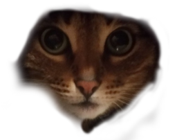
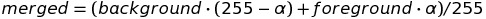
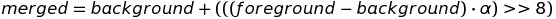
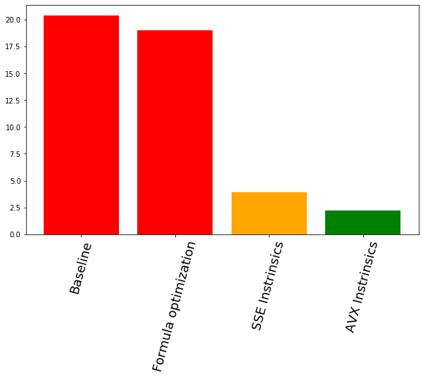

# Alpha blending optimization using Processor Vector Extentions

## Introduction into Alpha-blending
Alpha-blending is a technique for combining two images &ndash; one on the top has additional transparency info for each pixel of the image. For the sake of example I've taken picture of my cat and cut out her muzzle using GIMP:

I've also taken random image of person in the hood from the internet:

You will see the result later

## Alpha blending formula
One of the ways to perform alpha blending is using this formula:

Where alpha is value between 0 and 255 (incl.). Implementation using this formula and compiled with -O3 flag takes 19.616 second to merge two testing images 50000 times. After that I've optimized in in order to minimize number of operations:

This formula with the same setup takes 18.990 second. I've done some experiments and have figured out that it works perfectly in case values can be at least two-byte.  Since we need to use two-byte variables for multiplication, this will do. 

## Going vectorized.
However, with the usage of SSE instruction we will be able to merge sixteen pixels almost simultaneously, or thirty two pixels using AVX2!. If you want to dive into details on how to implement algorithm this way, you could check out the source code.

Overall, here is performance on the same test with the same compilation settings:

Oh, and here is the final blended image:

#### Thank you for your attention!